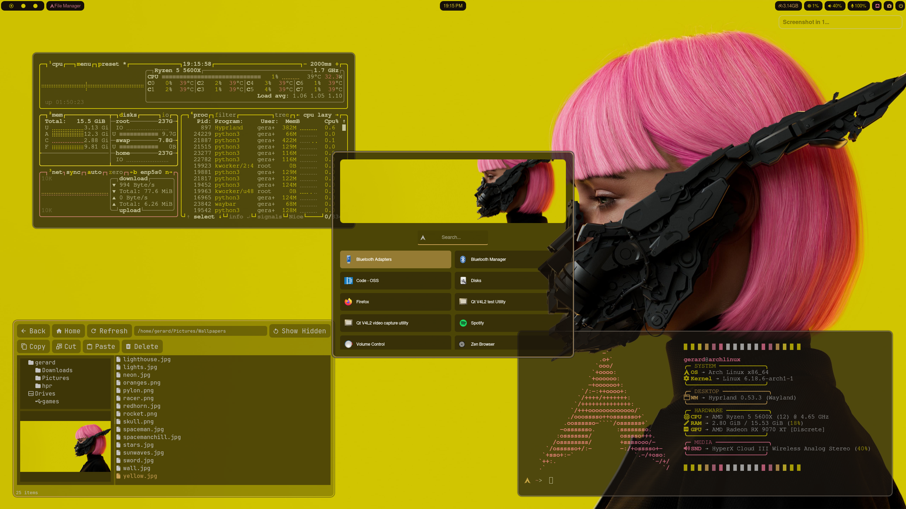

 ## 🚀 Key Features

 Custom Wallpaper Picker: A native .py GUI to browse and set wallpapers on the fly.

 Integrated App Launcher: A lightweight Python-based picker to launch your favorite applications.

 Simple File Manager: A streamlined .py script for quick file navigation and management.

 Dynamic Theming: Full integration with pywal to sync your system colors with your chosen wallpaper.
 
 ## 🖼️ Screenshot



## ⚠️ Installation


Only tested with min Arch.

```bash
git clone https://github.com/Saltyfunnel/hpr
cd hpr
chmod +x scripts/*.sh
cd scripts
sudo sh install.sh
```

💡 Startup Notes

On the very first launch after installation, you might see a small Hyprland error. This is normal! It just means the auto-theming script hasn't picked a wallpaper yet.

The Fix (Quick & Permanent):

    Press the keybind SUPER + w to launch the custom wallpaper chooser.

    Select any wallpaper from the list.

Choosing a wallpaper will run the theming script, resolve the initial error.


